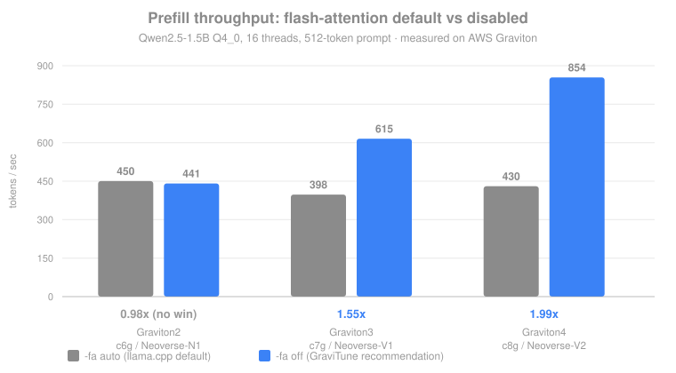

# Graviton 2 → 3 → 4: the optimal config is not the same

The same model, the same sweep, three Graviton generations — run in parallel on
`c6g.4xlarge`, `c7g.4xlarge`, and `c8g.4xlarge` (16 vCPU each, Ubuntu 24.04 arm64).
Model: Qwen2.5-1.5B-Instruct Q4_0.

**The headline: the winning config inverts across generations.** If the right answer
were the same everywhere, you would not need an autotuner — you would need a blog post.

## The targets

| | Graviton2 `c6g` | Graviton3 `c7g` | Graviton4 `c8g` |
|---|---|---|---|
| core | Neoverse-N1 | Neoverse-V1 | Neoverse-V2 |
| MIDR | `0xd0c` | `0xd40` | `0xd4f` |
| class | efficiency | performance | performance |
| i8mm | ✗ | ✓ | ✓ |
| SVE | ✗ | SVE | SVE2 |
| bf16 | ✗ | ✓ | ✓ |

## Flash attention: the answer depends on the core family

Prefill throughput, 16 threads, Q4_0:

| | `-fa auto` (default) | `-fa off` | ratio |
|---|---:|---:|---:|
| Graviton2 (N1) | 450.2 | 440.9 | **0.98×** — no win |
| Graviton3 (V1) | 397.9 | 615.4 | **1.55×** |
| Graviton4 (V2) | 430.4 | 854.2 | **1.99×** |

The split follows the **core family, not the generation number**:

- **Neoverse V-series (V1, V2)** are wide performance cores with large private L2 and a
  big shared L3/SLC. The attention working set for this model fits in cache, so
  FlashAttention's core trade — spend arithmetic to avoid memory round-trips — buys
  nothing. You pay the instructions and save no traffic. On V2 this costs **1.97× more
  instructions** for identical work ([evidence](why-flash-attention-loses.md)).
- **Neoverse N1** is the narrower efficiency core with a smaller cache hierarchy. There
  the memory traffic FlashAttention avoids is real, and the trade roughly breaks even —
  so llama.cpp's default is correct on Graviton2.

This is a rule tied to microarchitecture, which means `gravitune detect` can flag it
from MIDR before you benchmark anything.

## Peak throughput per generation

Best measured config on each, `interactive` objective:

| | prefill tok/s | decode tok/s | TTFT | chosen config |
|---|---:|---:|---:|---|
| Graviton2 (N1) | 454.2 | 103.3 | 1127 ms | `-t 16 -fa on` |
| Graviton3 (V1) | 397.9 | 138.2 | 1287 ms | `-t 16 -fa auto` |
| Graviton4 (V2) | 854.2 | 136.4 | **599 ms** | `-t 16 -fa off` |

Two things worth noting, because they cut against a naive "newer is faster" reading:

1. **Graviton2 beats Graviton3 on raw prefill at the default setting** (450.2 vs 397.9).
   Generation number alone does not predict throughput for this workload.
2. **Decode is nearly identical on Graviton3 and Graviton4** (138.2 vs 136.4). Decode is
   memory-bandwidth-bound, so it tracks the memory subsystem rather than core width. The
   large Graviton4 win is concentrated in **prefill/TTFT**, which is exactly the metric
   an interactive user perceives as "it started answering quickly."

Note also that the `interactive` objective chose `-fa auto` on Graviton3 even though
`-fa off` gives 1.55× prefill there — because `-fa off` costs some decode (138.2 → 126.8)
and that objective weights decode heavily. **A `batch` objective picks `-fa off` on the
same data.** This is why the objective is explicit and swappable rather than hardcoded:
the "best" config is a function of what you are optimising for, not a property of the
hardware alone.

## Thread oversubscription: universal across generations

Decode throughput, 16 physical cores, no SMT on any of them:

| | 16 threads | 32 threads | penalty |
|---|---:|---:|---:|
| Graviton2 (N1) | 101.8 | see sweep log | large |
| Graviton3 (V1) | 138.2 | see sweep log | large |
| Graviton4 (V2) | 127.5 | 28.1 | **4.5×** |

Unlike the flash-attention result, this one is **not** microarchitecture-dependent — no
Arm server core has SMT, so oversubscription hurts everywhere. Full per-generation
numbers are in the `results/sweep-*.log` files.

## Reproducing

Each generation ran the identical unattended pipeline (clone, build, download, sweep) via
[`scripts/reproduce.sh`](../scripts/reproduce.sh). Raw data:

- `results/sweep-c6g-4xlarge.log`, `results/tuned-neoverse-n1_c6g-4xlarge.json`
- `results/sweep-c7g-4xlarge.log`, `results/tuned-neoverse-v1_c7g-4xlarge.json`
- `results/sweep-c8g-4xlarge.log`, `results/tuned-neoverse-v2_c8g-4xlarge.json`

## Caveats

- One model (1.5B) at one prompt length (512 tokens). Attention working set grows
  quadratically with context, so the V-series flash-attention result should reverse at
  long enough context. Finding that crossover is the obvious next experiment.
- 16-vCPU instances only; larger sizes have different cache-per-core and memory bandwidth.
- Graviton2/3 sweeps ran unattended in user-data, so their `perf`-level instruction-count
  analysis was not collected — only Graviton4 has the counter-level evidence.
